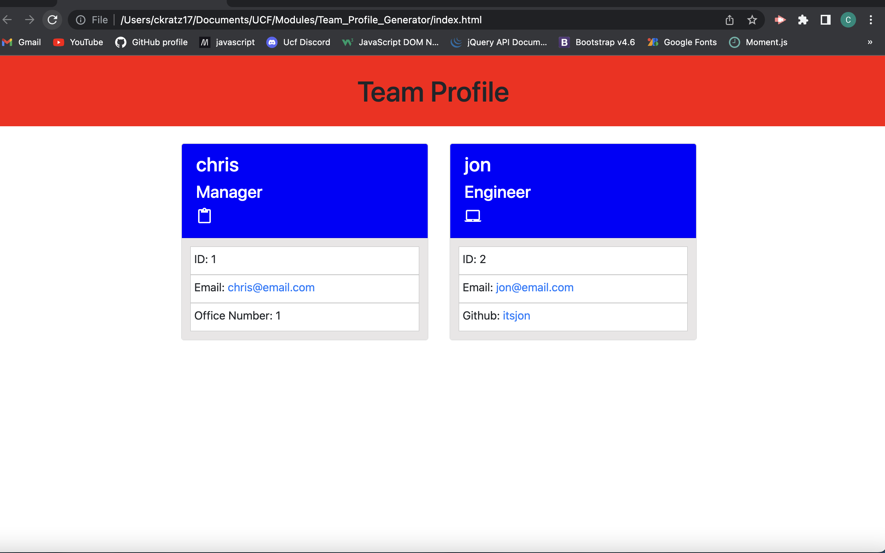

# Team Profile Generator

    ##Table of Contents
   
[Description](#description)
    
[Installation](#installation)
    
[Usage](#usage)
    
[License](#license)
    
[Contributing](#contributing)
    
[Testing](#testing)
    
[Questions](#questions)
    
## Description
    
Generate a team profile page by filling out the information in the command line. A HTML page is then generated with all the information the user fills out.
    
## Installation
    
First, you want to clone the file in github repo. 
    
## Usage
    
Once the file is cloned, open the file up in VScode and open up an integrated terminal. Run node index.js and fill out the questions to generate your team page.
    
## License
    
MIT
    
## Contributing
    
n/a

## Testing

n/a

## Questions

## Screenshot

(https://github.com/ckratz17/Team_Profile_Generator)

ckratz17@gmail.com